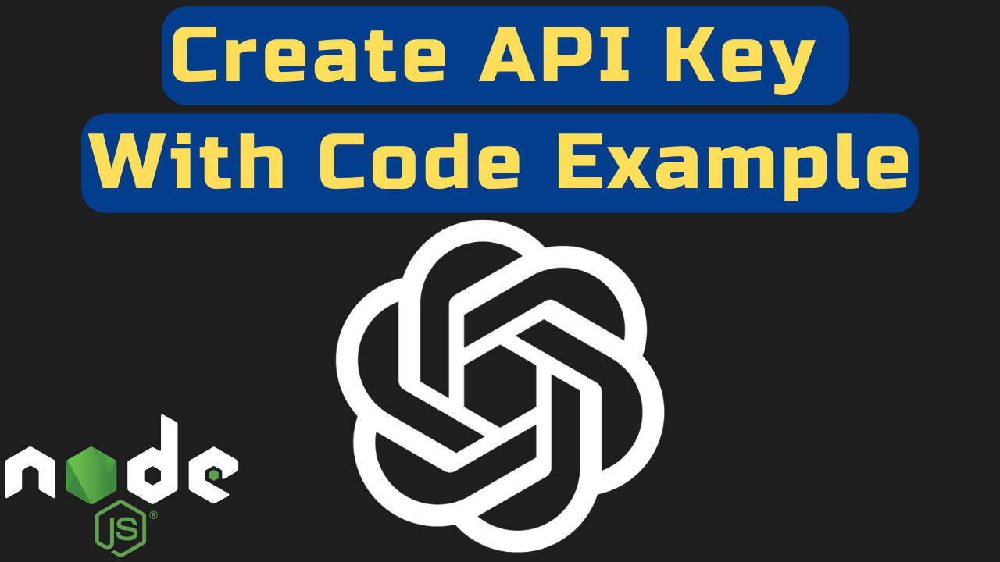

# How to create OpenAI API Key and Example Code with Node.JS



### YouTube Tutorial:

Follow along with the video to create an API Key
Coming soon

### Description:

In this tutorial, you will learn how to create an OpenAI API key(ChatGPT API key) and use it in a Node.js application. With this API key, you’ll be able to interact with ChatGPT and leverage its capabilities in your projects.

With the release of GPT-4o pricing will be cheaper and request will be faster!

I also show you how to remove the following error:

```
DeprecationWarning: The `punycode` module is deprecated. Please use a userland alternative instead.
```

If you enjoy this tutorial please subscribe, like and share on YouTube.
